# Sensei
Sensei is your study guide. 

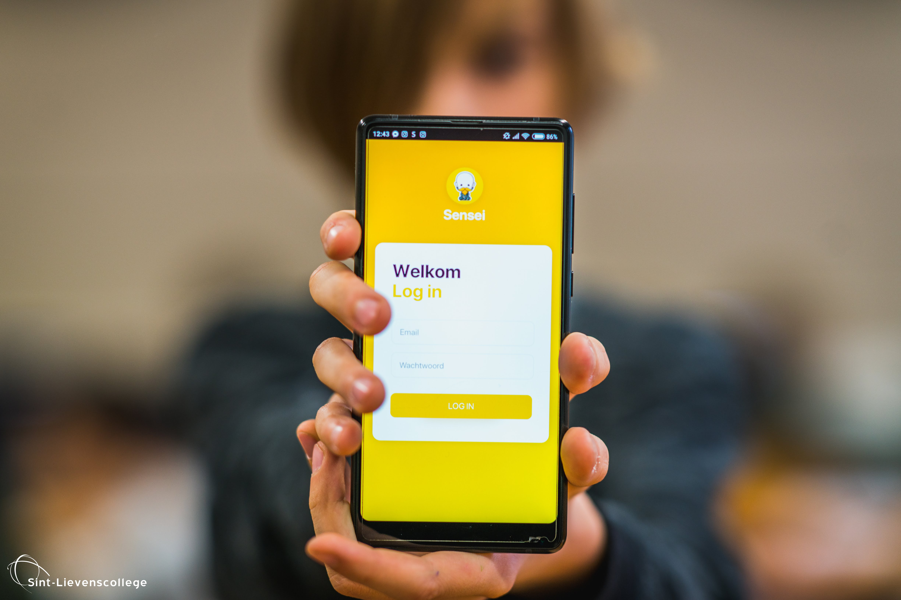

## Summary
Sensei is a web app for students (12 - 18y) that encompasses 3 pages: a dual-mode chatbot, a study scheduler and a feedback pane. Sensei is built to empower student learning by using a data-driven approach.

Final project for the Building AI course

## Background

Which problems does your idea solve? How common or frequent is this problem? What is your personal motivation? Why is this topic important or interesting?

Sensei is an web app for students (ages 12 - 18 years old) that encompasses three pages. Page 1 is chatbot where students can ask questions concerning best practices for studying a certain topic, course ... this chatbot will have a secondary role (where data will come in play, discussed later). Page 2 is a scheduler where students can create 'focus events'. In such an events, they pick a time, date, topic (from a database, e.g. airtable) and duration. Upon starting the focus event, the app mutes notifications and other triggers. Upon completing an event, the students checks oof which goals (also included in the database) where completed. Page 3 is a general overview / feedback panel where the student can check their progress for each topic. This progress is respresented by time invested and goals completed. 
The data from the sheduler (time spent on topic X, goals completed ... ) are combined with the students grades to actively trigger the chatbot / app to remind the students to complete additional goals, restudy certain topics ...

* problem 1: students require increased amout of personal study support
* problem 2: study data is not recorded or used for furthering learning 
* problem 3: students benefit from direct feedback in an increasingly online world
* problem 4: students stand to benefit from data driven nudging to further learning 

## How is it used?

! Important notification: this project is already under development by yours truly. This is part of a Flemish school project, so all images and examples will feature dutch text. 

As described in the abstract, this entails a responsive web app that encompasses three pages or use cases. These three cases will be listed below. Each of these cases will be described in detail after listing. 

##1- chatbot 

##2- scheduler

##3- feedback / progress pane 

##1- chatbot 
The chatbot has two modes: 
##A) Passive 
In this mode, the students initiates the conversation with a question. The chatbot is a form of narrow AI which contains pedagogical / educational best practices and how-to's. These will be supplied to the student in text and video. These video's will be hosted on a video streaming service (e.g. YouTube) and are selfmade by my colleagues and me. This chatbot-mode only uses the users name-tag (var pulled from single sign-on via school e-learning platform) and class_group tag. 
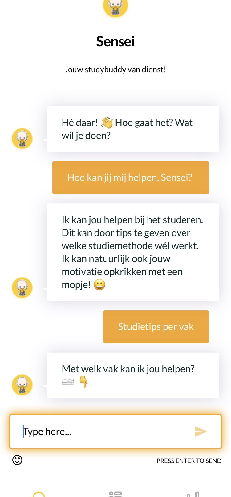
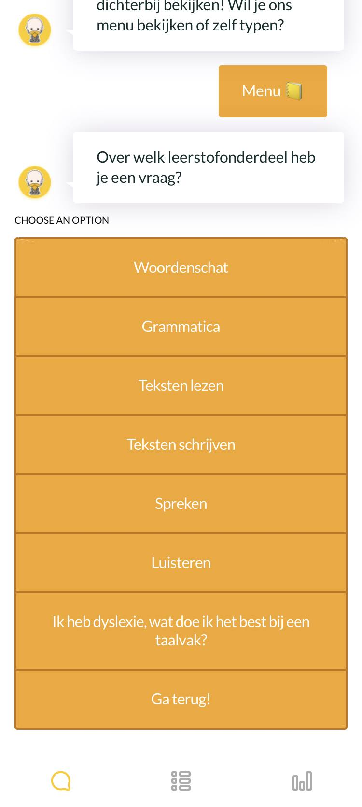
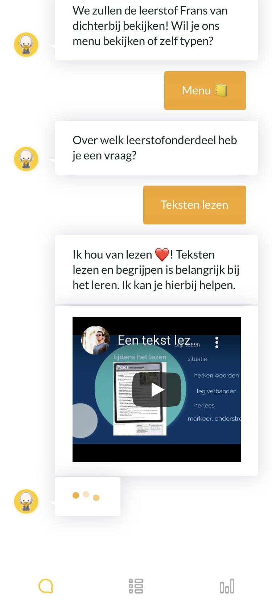

##B) Pro-active 
In this mode, the chatbot will use data generated by the user. The data will by generated by the user through using the scheduler (creating events, completing events ...) and the evaluation data from the e-learning platform. Using aforementioned data, the bot will nudge the user to study for topics in which the student is lacking, underperforming or hasn't invested significant time in. This data is also viewable from page 3 in the app (feedback / progress pane). 

##2- Scheduler 
Page 2 is a scheduler where students can create 'focus events'. In such an events, they pick a time, date, topic (from a database, e.g. airtable) and duration. Upon starting the focus event, the app mutes notifications and other triggers. Upon completing an event, the students checks oof which goals (also included in the database) where completed. 
The scheduler is the main focus when talking about 'data generation'. It is this data that, in combination with grades, will be used for the pro-active function of the chatbot.
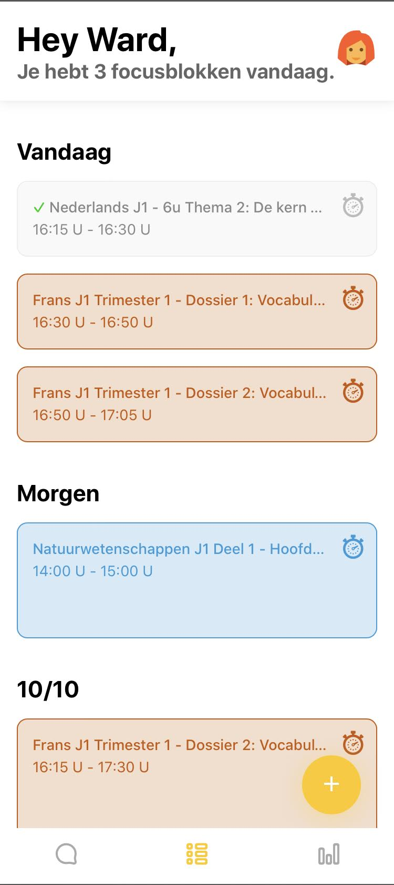
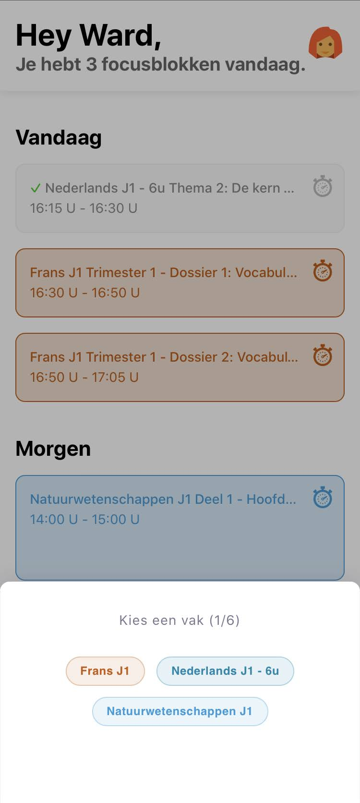
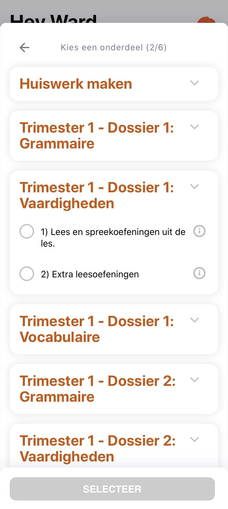
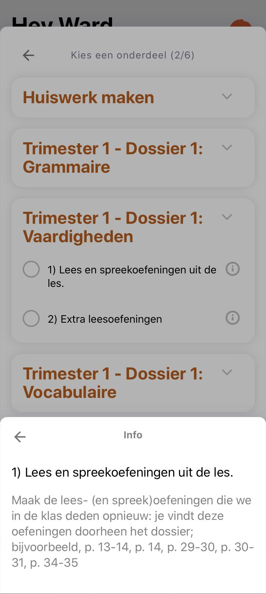
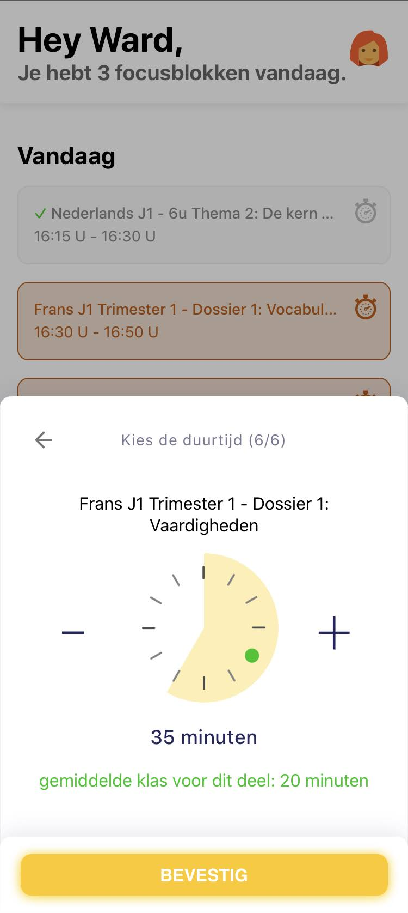
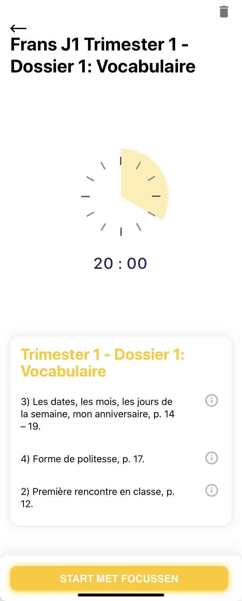
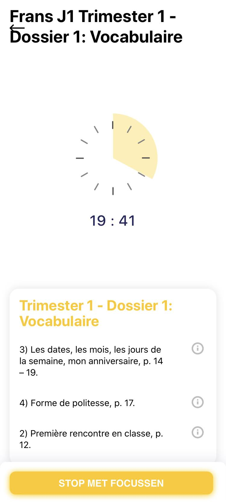

##3- Feedback / Progress Pane
On the thrid and last pane, the student can view their progress on each subject (math, French ...). Upon tapping a single subject, the student is presented with the different completed / uncompleted goals. 

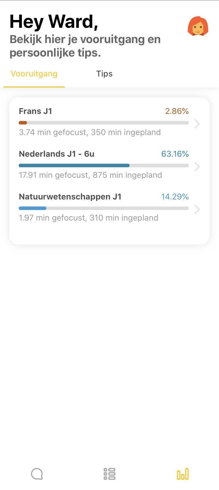
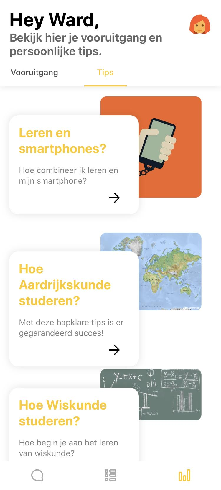

## Data sources and AI methods
Data comes from a few sources. 
Data concercing subjects, goals and descriptors are stored in a database (AirTable was used) by an operator (me). Data such as student study time, goals completed etc. are being generated through the app by the user and stored in a database (AirTable was used). Data was fed to the chatbot using webhooks and event triggers. (still work in progress). 

## Challenges

1) scaleability: every school differs in courses and subjects they offer, makes onboarding for each school a hassle (reentering all subject data)

2) running cost: since the bot, app and database entail service costs, a fixed price per user or per school such be suggested. Education is a mostly non-profit business in Flanders with near zero margins for these projects to run at scale. 

3) Privacy: since the user generated data is stored in a central database, users will be assigned a non-descript hexacode to hide identity. 

4) Data and model: to make the pro-active chatbot work, a model needs to be devised that can correctly attribute weigths to all inputs (study_time_course_x, grade_course_y ... ) and enable the bot to nudge the student. This part has not being completed! 

## What next?

Challenge number 4 is the most pressing to furthering this work in progress project. This will require proper models based on educational data (generated by the user) but also scientific insights on the frequency of nudges, timing of nudges ... 

## Acknowledgments

* this is a project conceived by me and my colleagues at Sint-Lievenscollege Gent, Zilverenberg 1 Ghent, Belgium. 
* do not use code, images, data etc. from others without permission
